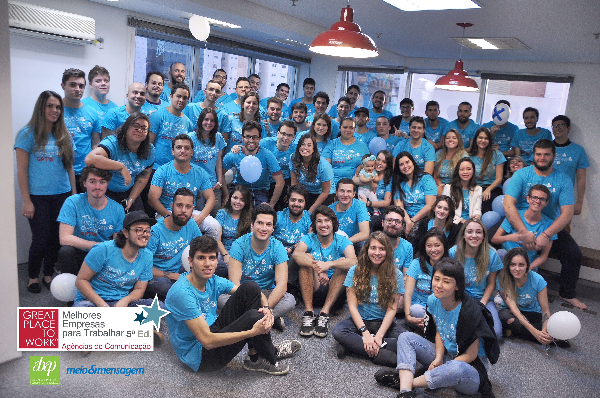

# test-enext-backend-php

Neste teste, deverão ser feitas duas tarefas respeitando os seguintes itens:

1. O backend deve ser feito em PHP;
2. Pode ser utilizado qualquer banco de dados;
3. O front-end pode utilizar qualquer tecnologia, recomendamos o uso de html, css, js + bootstrap;
4. O código deve ser desenvolvido com git, utilizando commits para cada feature desenvolvida;
5. O repositório deve conter um README.md explicando o funcionamento do código, processo para deploy local, endpoint construídos etc
6. A API construída deve ser REST com autenticação via JWT;
7. É necessário definir e documentar como seriam todos os endpoints da aplicação, mas você pode implementar apenas 7 deles. Cite no README.md como seriam todos os endpoints da aplicação e mencione aqueles que você implementou;
8. Em relação ao front-end, você deve escolher e implementar apenas 2 páginas da aplicação. Mencione no README.md quais páginas você escolheu para implementar e onde essas páginas estão no código;
9. O layout fornecido para o projeto contém alguns pontos que podem ser ignorados. Caso haja alguma dúvida se você deve implementar ou não algum ponto use o seu bom senso e mencione no README.md as simplificações que considerou;
10. É obrigatório a implementação do endpoint de auto-complete de produtos.

## Aplicação a ser desenvolvida

[https://projects.invisionapp.com/share/G2RKZB9KXES#/screens/360630744](https://projects.invisionapp.com/share/G2RKZB9KXES#/screens/360630744)

O link acima contém o layout das páginas de uma aplicação web. Tal aplicação é uma calculadora de produtos químicos que nós diz o quanto uma fórmula química é saudável para o meio ambiente (indice de vegetalização). Tal aplicação deve respeitar os seguintes requisitos:

1. Nessa aplicação, o usuário poderá montar fórmulas e analisar o índice de vegetalização dessas fórmulas;
2. Cada fórmula é composta por 1 ou mais produtos;
3. Um produto contém os seguintes atributos:
  3.1 INCI Nam: nome do produto;
  3.2 Produto BASF: É um produto da BASF ou customizado pelo usuário;
  3.3 Marca do produto;
  3.4 Índice de vegetalização: Indice de vegetalização do produto, um número inteiro de 0 a 100. Quanto maior, melhor é tal produto é para o meio ambiente.
4. O índice de vegatalização de uma fórmula depende da concentração de uso de cada produto, bem como do índice de vegetalização desse produto. O índice de vegetalização da fórmula é a média aritmética ponderada do indice de vegetalização dos seus produtos. Dessa forma se tivessemos uma formula F1, composta pelos produtos P1 e P2, teriamos que I(F1) = C(P1) * I(P1) + C(P2) * I(P2) onde I representa o indice de vegetalização do produto ou da fórmula e C representa a concentração do produto nessa fórmula;
5. É necessário que você crie um script PHP ou SQL que insira alguns produtos BASF fake pré cadastrados na aplicação, ou seja, todos usuários tem acesso ao produtos BASF pré cadastrados;
6. Na aplicação, o usuário pode adicionar novos produtos, que podem ser BASF ou não;
7. Um usuário tem acesso a todos os produtos BASF pré-cadastrados, mas pode não consegue acessar produtos criados por outros usuários;
8. Um endpoint obrigatório a ser imeplementado é o endpoint que retorna uma lista de produtos baseado em um INCI name fornecido. Tal endpoint será utilizado para fazer o auto-complete dos produtos na criação de fórmulas: na página de criação de uma fórmula o usuário iria digitar as letras iniciais do INCI name do produto que deseja e um select apareceria com os produtos compativeis com o INCI name que o usuário digitou.

## Tarefa 1

Desenvolva uma API Rest para aplicação mencionada acima. Mencione no README.md todos os endpoints, mas implemente apenas 7 deles, considerando a obrigatoriedade do endpoint de busca de produtos baseado no INCI name.

## Tarefa 2

Escolha e implemente apenas 2 páginas da aplicação. Mencione no README.md quais páginas você escolheu para implementar e onde essas páginas estão no código.

## Boa Sorte!!!

Casa haja alguma dúvida muito grande envie um email para back@enext.com.br esclarecendo-a dúvida que iremos respondê-la ASAP (As Soon As Possible)

Lhe desejamos uma boa sorte nesse teste, não se distraia por nada quando estiver programando =P e se tudo der certo, você será super bem vindo para o time Enext!!!

